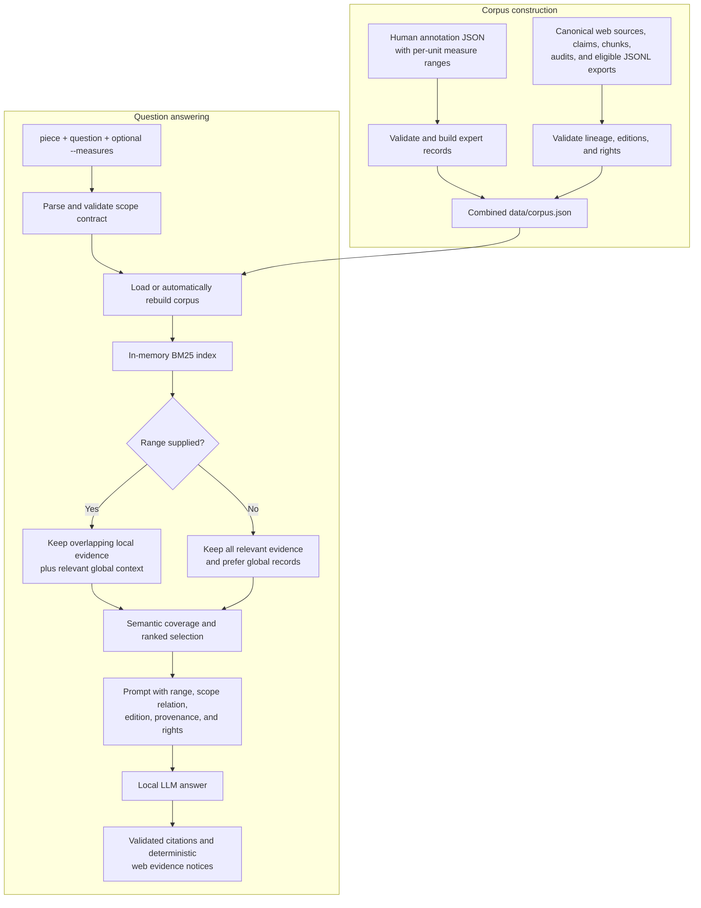

# Measure-aware RAG pipeline

This document explains how the local Soprano QA system combines a question,
a piece identifier, and an optional measure range to retrieve evidence and
generate an answer.

The central rule is:

> The question supplies the semantic intent, while `--measures` supplies the
> authoritative score location. With a range, non-overlapping local evidence
> is removed and overlapping evidence is prioritized. Without a range, there
> is no overlap filter and the request is treated as a whole-song question.

Measure numbers are structured retrieval metadata. They are not appended to
the BM25 query as ordinary search words.

## End-to-end overview



## 1. What is searched at runtime

The answer command does **not** query the collector's
`database/exports/database.sqlite3` file, make network requests, or search the
source database separately from the expert annotations.

Instead, corpus construction materializes both lineages into a single local
JSON corpus:

- Human evidence comes from the consolidated and spellchecked expert
  annotation units.
- Web-database evidence comes from `research-open.jsonl` and
  `research-conditional.jsonl`.
- Canonical web sources, claims, chunks, rights assets, and release audits are
  read to validate those exports before their records are accepted.
- `catalog-only.jsonl` is not answer evidence, and the currently empty
  `demo-local.jsonl` partition is not ingested.

At query time, the application checks whether this generated corpus is current,
loads `data/corpus.json`, and constructs an in-memory `BM25Index`. Therefore,
"database lookup" in this application means retrieval over the validated web
records already present in the combined corpus, not a live SQL lookup.

The current generated snapshot contains:

| Evidence | Global | Local | Multi-range | Total |
| --- | ---: | ---: | ---: | ---: |
| Human expert annotations | 39 | 61 | 10 | 110 |
| Web-database records | 101 | 0 | 0 | 101 |
| Combined | 140 | 61 | 10 | 211 |

One human placeholder record is retained for stable lineage but marked
non-retrievable, leaving 210 answer-eligible records. Of the web records, 81
are `research_open` and 20 are `research_conditional`.

### Human annotation lineage

The builder indexes the original annotator records by `source_id`, then reads
the phase-2 consolidated units and phase-3 spellchecked units for each piece.
It verifies that spellchecking preserved the array structure, `source_ids`,
topic, measure range, and question provenance. Every referenced source must
belong to the same piece and topic, and all original annotation sources must be
covered by the consolidated corpus.

Each accepted unit becomes one stable `sqa-####` record. Its measure range is
copied from the human consolidation pipeline and validated; retrieval does not
invent or widen that range. Expert `source_ids` and annotators remain attached
to that record and are never mixed with web `claim_ids` or `web_source_ids`.

### Record-level measure metadata

Every corpus record carries the common routing fields below. Web records add
edition fields when applicable:

| Field | Meaning |
| --- | --- |
| `piece` | Canonical piece slug. It is a hard query filter. |
| `measure_range` | Zero or more inclusive `[start, end]` pairs. `[]` means no specific bar. |
| `measure_scope` | Normally `global`, `local`, or `multi_range`; an expert override may declare an explicit recurring range set as `recurring`. |
| `evidence_type` | `expert_annotation` or `web_database`. |
| `relevance_text` | Semantic topic/question/answer text allowed to establish relevance. |
| `retrieval_text` | Ranking text; for web records it may additionally contain source titles and institutions. |
| `edition_id` / `measure_system` | Web-only edition identity and bar-numbering convention when a web claim is measure-specific. |

Ranges must contain positive integers and be ascending. An empty range becomes
`global`, one range becomes `local`, and multiple ranges become `multi_range`.
Feature overrides can mark a human record as `recurring`, but only when it has
one or more explicit valid ranges.

### Why current web records are global

All 101 web records in the current corpus have `measure_range: []` and
`measure_system: null`. Some have an `edition_id` because they describe a
particular edition or recording, but an edition association alone does not
establish bar-number grounding.

The corpus validator rejects a measure-specific web claim or chunk unless it
has both:

1. an explicit `edition_id`; and
2. non-empty `measure_system` metadata.

The upstream database schema and policy use that metadata to identify the
applicable pickup and bar-numbering convention. This application requires the
field to be present and verifies that chunks and linked claims agree on it; the
upstream dataset validator owns its deeper structural validation.

The chunk must also agree with all linked claims on piece, knowledge scope,
edition identity/context, measure range/system, and source union. Each claim
topic must map to the chunk topic, and the claim topics must equal the chunk's
subtopic set. Every linked
claim must resolve to the chunk's export/usage class, and generated and
inherited license metadata is recomputed from the linked evidence.
Consequently, in the current release only human annotations can ground a claim
about a requested bar. Web records can still provide relevant whole-work,
creator, edition, historical, performance, or rights context.

If edition-qualified web measure records are added later, the existing overlap
logic will route them like any other ranged record; no separate SQL path is
needed.

### Web rights and provenance gate

The builder does not trust an export label by itself. For each linked claim it
resolves the exact `web_source_id` and reviewed `asset_id`, then recomputes the
effective class from the asset's rights status, explicit storage, adaptation,
text-mining and redistribution permissions, and governing jurisdiction.

- `research_open` contains reusable open material or independently written,
  verified factual text that passed the applicable rights and expression
  gates.
- `research_conditional` remains answer-eligible but retains NC, SA,
  permission, or territorial conditions.
- A raw `facts_only` claim can resolve into the `research_open` export only
  after its record and evidence lineage match a hash-bound release audit that
  finds no protected source expression.
- Incompatible conditional license families cannot be combined into one
  chunk, and the chunk's source IDs must equal the exact union of its claims'
  sources.

`generated_text_license` describes the stored Korean chunk text. Independently
authored project text remains CC BY 4.0; when permitted source expression is
retained, its one compatible inherited license applies. This field never erases
separately recorded source-asset conditions. For records with
`inherited_licenses`, attribution, rights status, permissions, license and terms
URLs, and jurisdiction limits remain attached and are printed later in
deterministic evidence notices. This gate is why only the 101 answer-eligible
web chunks enter this RAG corpus, rather than every item known to the external
database.

## 2. The query scope contract

The CLI always requires `--piece` and `--question`. `--measures` is optional:

```bash
# Measure-specific
python3 scripts/ask.py \
  --piece die-forelle \
  --measures 28-30 \
  --question "28마디부터 분위기 변화를 어떻게 표현해야 하나요?"

# Whole song: --measures is deliberately absent
python3 scripts/ask.py \
  --piece die-forelle \
  --question "이 작품의 정식 표제와 작품 번호는 무엇인가요?"
```

`--measures` is parsed into inclusive pairs:

| CLI value | Structured value |
| --- | --- |
| omitted or `""` | `[]` |
| `12` | `[[12, 12]]` |
| `28-30` | `[[28, 30]]` |
| `12, 35-38` | `[[12, 12], [35, 38]]` |

Hyphens and common Unicode dash variants are normalized. Zero, negative,
descending, empty, and malformed items are rejected.

### The question does not silently set the range

Natural-language measure expressions are extracted only to check the request;
they do not replace `--measures`. The CLI flag remains the authoritative scope
used by retrieval.

Recognized question forms include, among others:

- `28마디`, `제28마디`, `28번째 마디`, `첫 번째 마디`
- `28마디부터 30까지`, `28-30마디`, `28마디~30마디`
- `28, 30마디`, `28-30, 40마디`
- `bar 28`, `bars 28-30`, `measure 28 to 30`, `m.28`
- `첫 4마디` or `opening 4 bars`, which means measures 1-4

The validation rules are:

1. If the question names a score location but `--measures` is absent, the
   command fails before retrieval.
2. If the question names locations outside the union supplied by
   `--measures`, the command fails.
3. A broader flag is allowed. For example, a question mentioning bar 28 is
   covered by `--measures 28-30`.
4. Passing `--measures` is allowed even when the question does not repeat the
   numbers.
5. Relative phrases such as `마지막 마디` or `last bar` require an explicit
   numeric flag because the parser does not guess the final bar.

Some numbers describe duration or total length rather than location. Forms
such as `4마디 프레이즈` and `총 67마디인가요?` remain valid whole-song
questions and do not require `--measures`.

This separation prevents an accidental mismatch in which the prose asks about
bar 40 while retrieval is scoped to bar 28, and it makes omission of the flag
an unambiguous declaration of whole-song intent.

## 3. Query normalization and semantic relevance

Before lexical retrieval, the application removes score-location expressions,
piece aliases, and question scaffolding from the text. For example:

```text
Question: 28마디부터 분위기 변화를 어떻게 표현해야 하나요?
Range:    [[28, 30]]
Concepts: 분위기, 변화, 표현
```

The measure expression is removed from the lexical concepts because the range
is already represented structurally. Korean particles and common inflections
are normalized, and Korean two- and three-character n-grams help BM25 ranking.
N-gram fragments cannot independently pass the semantic relevance gate: each
full normalized question concept must be supported by the selected evidence.

Two text fields deliberately have different jobs:

- `relevance_text` determines whether a record can answer the question. It
  includes semantic topics, controlled Korean web-topic labels, the question,
  answer, subtopics, features, and applicability notes.
- `retrieval_text` is used for BM25 ranking and may also include web source
  titles and institutions.

As a result, a publisher or library name may refine ranking after a record is
semantically eligible, but provenance metadata alone cannot make an unrelated
record answer the question.

## 4. Retrieval when a measure range is supplied

The index first applies filters that are independent of scoring:

1. Skip records marked `retrieval_eligible: false`.
2. Require an exact `piece` match.
3. Apply the optional `--topic` substring filter.
4. Classify the record's relationship to the requested range.

For a ranged query, the relationship is:

| Record metadata | `scope_match` | Kept? |
| --- | --- | --- |
| Its range intersects any requested range | `overlaps_query_range` | Yes |
| It has `measure_range: []` | `global_context` | Yes, when semantically relevant |
| It has ranges but none intersects | `outside_query_range` | No |

Overlap is inclusive and checks every requested-range/record-range pair. Thus,
a record with `[[56, 56], [6, 6]]` overlaps a query for measure 6.

Non-overlapping local evidence is removed before lexical ranking. This is the
main safety property: an otherwise similar performance tip for bar 40 cannot
enter the model context for a bar 28 query.

The remaining candidates receive a range-aware score adjustment:

| Ranged-query relation | Adjustment |
| --- | ---: |
| Overlapping `recurring` expert record | `+6.0` |
| Other overlapping record | `+5.0` |
| Global context | `+0.25` |
| Non-overlapping local record | excluded |

The numeric search score is BM25 text relevance plus this adjustment. The
selected piece is already a hard filter; the reported `piece_score` is
diagnostic and is not added again.

More importantly, scope priority is sorted before numeric score. An overlapping
record therefore ranks ahead of a global record even when the global record has
a larger raw BM25 score.

Overlap is preferred, not required for retrieval to return anything. If no
semantically relevant overlapping record exists, relevant `global_context`
records may still be returned. They can support general background or the
general part of a compound question, but the prompt forbids using them to
answer the unsupported bar-specific part.

Range overlap by itself never establishes relevance. If a requested measure
overlaps an annotation about breathing but the question asks an unsupported
football question, that annotation is rejected by the semantic gate.

## 5. Retrieval when no measure range is supplied

An omitted flag parses to `[]` and activates whole-song mode. No overlap test is
performed and no local record is excluded because of its measures.

Records are classified as:

| Record metadata | `scope_match` | Adjustment |
| --- | --- | ---: |
| `measure_range: []` | `general_evidence` | `+1.5` |
| One or more ranges | `local_example` | `-0.25` |

General evidence is scope-prioritized ahead of local examples. A textually
relevant local example may still be returned, but its measure metadata is
preserved and the prompt tells the model to name those measures and not
generalize the example to the entire work.

Therefore, "range is not applied" means there is no requested-range overlap
filter. Record scope is still used as a ranking safeguard so that a narrow bar
example does not outrank an equally relevant whole-song record.

## 6. Compound questions and final selection

The system does not simply take the first `top_k` records with any matching
word. It first checks whether the candidate pool collectively covers every
full semantic concept in the question.

It then uses a bounded coverage search to choose a minimal set of records that:

1. covers all real query concepts and any controlled identity-intent anchors;
2. preserves the preferred scope (`overlaps_query_range` for ranged queries,
   `general_evidence` for whole-song queries);
3. fits within `top_k`; and
4. maximizes scope quality and then retrieval score.

Unused slots are filled from the remaining ranked candidates. If a concept is
unsupported, or `top_k` is too small to cover the compound question, retrieval
returns no result instead of answering only the convenient part as though it
covered the whole question.

In compact pseudocode:

```python
ranges = parse_measure_ranges(cli_measures)  # [] means whole-song
validate_question_measure_contract(question, ranges)
records = load_or_rebuild_combined_corpus()
semantic_query = normalize_and_remove_measure_syntax(question)

for record in records:
    if not record.retrieval_eligible or record.piece != piece:
        continue

    relation = measure_scope_match(record, ranges)
    if ranges and relation == "outside_query_range":
        continue
    if not record_matches_any_full_query_concept(record, semantic_query):
        continue

    candidate.score = bm25(semantic_query, record) + measure_boost(record, ranges)

results = minimal_full_concept_coverage(
    candidates,
    prefer="overlaps_query_range" if ranges else "general_evidence",
    limit=top_k,
)
```

## 7. Prompt construction and generation

Each selected record is serialized into the model context with:

- a short citation label such as `E1`;
- exact corpus ID and evidence type;
- piece, work, and topic;
- record measure range and measure scope;
- its relationship to the query range;
- expert `source_ids` and annotators, or web `claim_ids`, `web_source_ids`, and
  source URLs;
- web edition, edition context, and measure-system metadata;
- applicable web usage and license conditions.

The prompt also contains the raw requested range. When it is absent, the prompt
prints `(none; whole-song question)`.

The system instruction enforces the retrieval policy a second time:

- never apply advice from another measure;
- treat general evidence only as context for a ranged question;
- never use web evidence without an edition-qualified measure system to support
  a specific-bar claim;
- for a whole-song question, identify the measures of any local example and do
  not generalize it;
- preserve edition, recording, attribution, and rights qualifiers.

If retrieval returns no evidence, the model is not called. The application
returns a deterministic insufficient-evidence message.

If llama.cpp reports that the context is too large, the application repeats
retrieval with one fewer whole record until the prompt fits. It never truncates
a record halfway, and the final retrieval list, prompt, citations, and evidence
notices remain aligned.

After generation, short labels such as `[E1]` are mapped to exact corpus IDs.
Unknown citations are removed, an unambiguous mistyped opaque ID can be repaired,
and a deterministic evidence footer is added if the model omitted labels.
Rights and source notices for web records are constructed by application code,
not left to the language model.

## 8. Worked routing examples

### Ranged question

```text
piece: die-forelle
--measures: 28-30
question: 28마디부터 분위기 변화를 어떻게 표현해야 하나요?
```

1. The flag becomes `[[28, 30]]`.
2. The question's mention of measure 28 is covered by that flag.
3. Retrieval is hard-filtered to `die-forelle`.
4. `sqa-0058`, whose range is `[[28, 28]]`, is classified as
   `overlaps_query_range` and receives the overlap priority/boost.
5. Local Die Forelle records outside 28-30 are excluded.
6. Semantically relevant global records may follow as `global_context` but
   cannot ground claims specifically about measures 28-30.

### Whole-song question

```text
piece: die-forelle
--measures: omitted
question: 이 작품의 정식 표제와 작품 번호는 무엇인가요?
```

1. The structured range is `[]`.
2. No overlap filter is applied.
3. Global identity records, including eligible web-database evidence, are
   `general_evidence` and rank ahead of local examples.
4. A measure-bound example can still appear only if it is semantically useful,
   with its range disclosed to the model.

### Conflicting request

```text
--measures 28
--question "40마디의 분위기는 어떤가요?"
```

The request is rejected before corpus lookup because bar 40 is not covered by
the authoritative range `[[28, 28]]`.

## 9. Corpus freshness and reproducibility

Before each query, `ensure_corpus()` accepts the existing artifact only when all
of the following match:

- corpus schema version;
- resolved dataset root;
- selected web export list;
- SHA-256 fingerprint of expert annotations, consolidation/spellcheck phases,
  canonical web records, release audits, selected exports, and overrides;
- SHA-256 of the actual `data/corpus.json` file.

Otherwise, the corpus is rebuilt automatically. The builder checks that its
inputs did not change during construction, writes the corpus and statistics
through atomic replacements, and records the final corpus hash. This prevents
a stale or partially written corpus from silently changing range routing.

## 10. Inspecting the routing decision

Use retrieval-only JSON output to see the structured decision without invoking
the model:

```bash
python3 scripts/ask.py \
  --piece die-forelle \
  --measures 28-30 \
  --question "28마디부터 분위기 변화를 어떻게 표현해야 하나요?" \
  --no-generate \
  --json
```

The useful fields are:

- `query.measure_range`: the authoritative parsed scope;
- `results[].scope_match`: overlap, global context, general evidence, or local
  example;
- `results[].text_score` and `results[].measure_score`: lexical and scope
  contributions;
- `results[].record.measure_range` and `measure_scope`: evidence metadata;
- `results[].record.evidence_type`: human or web-database lineage; and
- `evidence_notices`: deterministic source and rights disclosures for selected
  web records.

## 11. Important boundaries

- This is dependency-free lexical BM25 retrieval, not an embedding/vector
  database.
- Range matching is inclusive numeric interval intersection; it does not infer
  musical equivalence between different editions.
- Positive and ascending ranges are validated, but the CLI does not currently
  verify a requested number against the actual final bar of the piece.
- Current expert ranges use the dataset's annotation convention. Web ranges are
  accepted only with explicit edition and measure-system identity.
- `--topic` is an additional substring filter and can intentionally narrow the
  candidate pool.
- Strict full-concept coverage favors safe abstention. A useful passage that
  does not support every material concept in the question is not presented as
  a complete answer.

## Implementation map

| Stage | Implementation |
| --- | --- |
| CLI and answer orchestration | `soprano_qa/answer.py`: `parse_args()`, `main()` |
| Range parsing and question contract | `soprano_qa/retrieval.py`: `parse_measure_ranges()`, `extract_question_measure_ranges()`, `validate_question_measure_contract()` |
| Range overlap and scoring | `soprano_qa/retrieval.py`: `measure_scope_match()`, `measure_boost()`, `scope_priority()` |
| BM25 and coverage selection | `soprano_qa/retrieval.py`: `BM25Index.search()` |
| Combined corpus construction | `soprano_qa/corpus.py`: `build_expert_records()`, `build_web_records()`, `build_corpus()` |
| Web edition/measure validation | `soprano_qa/corpus.py`: `validate_web_chunk_lineage()` and claim validation |
| Prompt context and generation retry | `soprano_qa/answer.py`: `build_context()`, `build_messages()`, `generate_with_context_retry()` |
| Citation and rights disclosure | `soprano_qa/answer.py`: `finalize_answer_citations()`, `build_evidence_notices()` |
