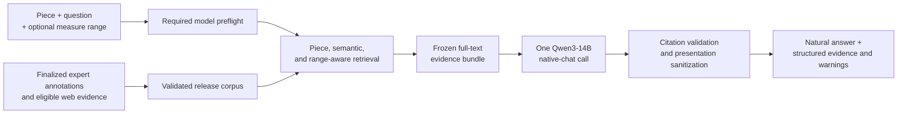

# RAG+LLM pipeline

The system answers a soprano-performance question from finalized expert
knowledge units and eligible supporting evidence. Retrieval selects the
evidence, and one local instruction-following model call composes the natural
answer. Retrieval confidence never selects a different answer renderer.

Its central scope rule is:

> The question determines **what** to retrieve, while the optional measure
> range determines **where** the evidence must apply.



## 1. Build a release-only corpus

`python scripts/build_corpus.py` builds `data/corpus.json` from two sources:

- reviewed knowledge units under
  `soprano-qa-dataset/expert_curation/review/`; and
- validated, answer-eligible records from the web database.

An expert corpus record contains only fields needed for retrieval, generation,
and audit:

- the complete curated `knowledge_units.answer` text;
- the stable knowledge-unit and source identifiers;
- original expert questions used as retrieval aliases;
- confirmed measure ranges and finalized location status; and
- materialized relevance text for lexical and dense retrieval.

Raw source answers, legacy range hints, annotator names, rewrite notes, measure
notes, conflict markers, and other editorial workflow fields are deliberately
excluded. They remain in the dataset repository for audit, but cannot leak
into a production prompt or answer.

Corpus construction is fail-closed. Every expert unit must have
`rewrite_status: ready` and a finalized measure status of `specific`,
`whole_piece`, or `unspecified`. The builder reports every offending unit and
stops rather than indexing provisional text. It validates all five review
documents, projects the strict release schema, rejects unexpected fields, and
atomically writes `data/corpus.json` and `data/corpus_stats.json`.

Stable record IDs remain important for provenance, artifact joins, and
diagnostics. They are not answer content and are not exposed to users.

## 2. Receive and validate a query

Every query supplies:

```text
piece_id + question + optional measure_range
```

For example:

```json
{
  "piece_id": "die-forelle",
  "question": "피아노 파트에서 두 번째 박의 악센트는 무엇을 표현할까?",
  "measure_range": [2, 27]
}
```

The measure range is structured metadata and does not need to be repeated in
the question. If the question itself names a measure, that location must fall
inside the selected range. The explicit locator becomes the effective
retrieval scope, while the structured selection remains its allowed envelope.

No selected range means only that the user did not choose a score location. It
does not assert that every retrieved claim applies throughout the piece. A
measure-specific expert unit may still answer a semantically complete
whole-song question, but the model must keep that advice tied to the described
situation rather than generalizing it to the entire work.

Generated requests preflight the configured answer model and backend before
corpus or retrieval work. Hybrid retrieval likewise preflights its embedding
model and backend. Missing, unreadable, or incompatible required resources
raise an error; the system does not silently change models or retrieval modes.

## 3. Retrieve candidate evidence

Retrieval proceeds in this order:

1. Keep records for the selected piece.
2. Apply the effective measure scope when one exists.
3. Run Korean concept normalization, BM25 search, and strict source-question
   alias matching.
4. Embed the natural question and retrieve semantically similar knowledge
   units.
5. Fuse lexical and dense ranks with weighted reciprocal-rank fusion.
6. Apply semantic, authority, and range checks independently of the similarity
   score.
7. Select a compact evidence set that collectively answers the question.

Dense retrieval uses `Qwen3-Embedding-0.6B-Q8_0.gguf`. Corpus and answer
vectors are normalized and cached using fingerprints of the corpus, model, and
runtime settings. Query vectors use a bounded in-process cache. Hybrid mode
requires this checkpoint and the `llama-cpp-python` backend; embedding failure
is a hard error rather than a lexical fallback.

Similarity never overrides release-corpus authority, piece identity, evidence
eligibility, or range applicability. Source-question aliases establish recall
for an annotation family, but the reviewed answer text decides which split
knowledge units actually address the requested relation. For example, a pure
causal question must not be answered only by a technique sibling merely
because both units came from the same original annotation. A question that
explicitly asks both why and how may retain both compatible facets.

### Selected-range queries

Ranges are inclusive. Each confirmed evidence interval is compared with the
effective selected interval.

| Evidence scope | Internal relation | Use |
| --- | --- | --- |
| Confirmed range overlaps the query | `overlaps_query_range` | Primary local authority |
| Explicitly whole-piece or global | `global_context` | Supporting background when relevant |
| Confirmed local range does not overlap | `other_range_context` | Range-mismatch context only |
| Location is unconfirmed | `unspecified_context` | Cannot establish a selected-range claim |

Scope priority is applied before final evidence selection. A relevant
overlapping expert unit outranks generic background. Non-overlapping records
may remain in the structured result so developers can diagnose a range
mismatch, but their musical claims are withheld from the generation context
and cannot be cited or transferred to the selected passage.

A web record can establish an exact measure claim only when it identifies the
applicable edition and its measure-numbering system. Otherwise it is general
context only.

### Queries without a selected range

No range-overlap filter is applied. Finalized units receive no automatic
ranking bonus or penalty merely because their location is whole-piece,
passage-specific, or unspecified. Their question and answer semantics decide
relevance.

A clearly matching passage-specific unit is labeled `local_example`
internally. Its confirmed range remains structured routing metadata and is
withheld from the prompt when the user did not request a location. The model
may use its advice naturally, but cannot claim that the same feature occurs
throughout the work, frequently, or in many places without separate
whole-piece authority.

For broad questions such as how to sing a work well, retrieval may select
several compatible units covering tone, diction, rhythm, technique, and
interpretation. Multiple units are useful when they add distinct relevant
details; evidence selection removes duplicates and merely related advice.

Semantic selection uses a stable candidate pool before caller-facing `top_k`
truncation. This prevents an apparently confident answer from arising only
because a competing candidate disappeared at a smaller display limit.

When a sparse no-range bundle has no original-question alias, the pipeline
consults reviewed-answer embeddings to correct a semantically weak route or
prune an oversized no-alias bundle. It keeps candidates in the strict 93%
near-tie band; the wider 91% band additionally requires direct lexical support
or explicit query-concept coverage. It does not fill the prompt to three units
and never consults an expected evaluation KU ID. The same focus is applied
when normal retrieval abstains but exposes diagnostic rejected candidates,
so that list is not blindly copied into generation. This prevents a dominant
match such as a fermata or interlude question from acquiring unrelated tempo,
notation, or phrase advice while still allowing several genuinely competitive
units for a broad question. When the absolute semantic score is weak, an
oversized bundle is pruned more conservatively; unsupported web neighbors are
also dropped when finalized expert evidence already grounds the question.

## 4. Freeze the complete evidence bundle

Once retrieval and scope checks finish, the selected evidence set is frozen.
For every selected expert record, the prompt receives the complete reviewed
knowledge-unit answer text. The pipeline does not reduce expert evidence to a
record identifier and does not make a separate model call to select IDs.

Temporary labels such as `[E1]` and `[E2]` are attached to the already selected
records. They are short citation anchors for grounding validation, not stable
knowledge-unit IDs and not an additional retrieval or selection stage.

The frozen prompt may contain several selected units when their claims are
compatible and materially improve completeness. The model sees their actual
text together in the same answer-generation request and composes one coherent
answer rather than returning an ordered list of excerpts.

For selected-range requests, the prompt also describes each record's internal
scope role. A non-overlapping context record exposes only the range-mismatch
signal; its musical claim is not supplied. For no-range requests, an
unrequested local unit's canonical measure numbers are withheld.

## 5. Generate one natural answer

The answer model is `Qwen3-14B-Q6_K.gguf`, the post-trained
instruction/chat checkpoint from `Qwen/Qwen3-14B-GGUF`. The configuration does
not force `chatml` or another `chat_format`; `llama-cpp-python` reads the native
`tokenizer.chat_template` embedded in the GGUF.

Every grounded generated request makes exactly one model call. There is no
confidence-dependent direct-text renderer, preliminary ID selector, second
model, repair call, extraction path, or internal-knowledge path.

The prompt instructs Qwen3-14B to:

- answer only from the supplied evidence;
- use formal-polite Korean consistently;
- preserve uncertainty, alternatives, causality, negation, and scope;
- combine distinct compatible details without repeating sentence frames;
- omit retrieved material that is merely related to the question;
- avoid inventing measures, notation, lyrics, pronunciation, or advice;
- keep local evidence local unless whole-piece evidence supports a broader
  statement;
- cite each factual or advisory sentence with its temporary `[E#]` anchors;
  and
- never print internal field names, scope labels, record IDs, retrieval
  explanations, or an evidence footer.

The full reviewed KU texts are prompt evidence, not text that must be copied
word-for-word. Natural synthesis is intentional, while semantic fidelity is
checked separately.

## 6. Validate and sanitize the sole draft

The application validates the generated draft against the frozen evidence:

- temporary citations must resolve to answer-authoritative records;
- context-only claims cannot be cited as selected-range authority;
- local evidence cannot silently become a whole-piece or frequency claim;
- unrequested measure locators and unsupported facts are detected;
- internal pipeline vocabulary, opaque IDs, and evidence footers are removed;
  and
- visible prose is normalized to formal-polite Korean.

If all semantic and scope checks pass, the application removes the temporary
labels and returns the sanitized answer. Exact provenance, rights information,
ranges, and retrieval scores remain available separately in structured
metadata.

If deterministic validation questions the answer, the pipeline still returns
the same model draft after mandatory presentation sanitization and records the
reason in `generation_validation_warning`. That warning is an evaluation and
review signal. It does not authorize a second call or replacement with
retrieved text, another model, or model-internal knowledge.

Model-load, backend, context-window, and inference failures propagate as hard
errors. When retrieval supplies no answer-authoritative evidence, production
may return a structured unavailable result before generation; the evaluation
runners do not accept that as a successfully completed answer case.

## 7. Return answer and audit metadata

For a grounded generated request, the service returns:

- the natural user-visible answer;
- `generation_mode: llm` and `answer_basis: retrieved_evidence`;
- `generation_validation_warning`, or `null` when no deterministic concern was
  raised;
- whether primary and selected-range grounding exist;
- the selected measure range; and
- exact evidence records, provenance, rights information, scope roles, and
  retrieval diagnostics.

The answer field never displays opaque record IDs, `[E#]` anchors,
`제공된 검색 근거`, `범위 안내`, `확인된 국소 예시`, or canonical measure numbers
that the user did not select or request.

With generation disabled, the service may return a separate retrieval-only
diagnostic result. That is not a generated answer path and is not accepted as
a completed evaluation answer.

## 8. Evaluation protocol

The five-piece evaluation contains 460 cases:

- 105 original-question cases;
- 306 paraphrase cases; and
- 49 coverage cases derived from 36 finalized knowledge units that lacked an
  original related question.

The derived questions exist only in evaluation data. They are kept out of the
corpus and retrieval aliases so that the benchmark does not leak its expected
wording into retrieval. Their source unit is a reproducible reference and
retrieval diagnostic target, not a required evidence ID: correctness is judged
from the answer's meaning and support across the reviewed evidence actually
used.

Each measure-scoped question uses one deterministic representative confirmed
range instead of being repeated for every annotated occurrence. A question
that names an exact lyric, word, or syllable is range-only and never receives
an artificial whole-song case. Two allowlisted whole-song KUs retain their
claim scope while an explicit reviewed measure hint supplies only the UI
selector context. Full range authority remains in the artifact. Hit@1, Hit@3,
Hit@6, and MRR are retrieval diagnostics rather than answer acceptance
criteria. Hit@3 is the primary early-recall signal, but a semantically correct
answer may be supported by a different reviewed unit.

Only `llm` / `retrieved_evidence` counts as a completed generated evaluation
case. Retrieval hits and validation warnings are diagnostics, not semantic
accuracy verdicts.

Direct semantic review is stored separately in
`evaluation/semantic_quality_review.json`. Every assessment is bound by a
semantic hash to the exact question, range, reference authority, generated
answer, ordered evidence bundle, and generation-validation warning. Flagged
cases retain the original response plus severity, reason codes, and rationale.
The complete comparison is available at `/`; the dedicated
flagged-case queue is available at `/red-flags`.

Fresh retrieval and semantic-quality metrics are pending until the final
pipeline has rerun all 460 cases and the hash-bound review is complete.

## Implementation map

| Pipeline stage | Main file |
| --- | --- |
| Corpus construction | `soprano_qa/corpus.py` |
| Measure handling and retrieval | `soprano_qa/retrieval.py` |
| Dense retrieval and index management | `soprano_qa/dense.py` |
| Prompt construction and answer finalization | `soprano_qa/answer.py` |
| End-to-end orchestration | `soprano_qa/service.py` |
| Original evaluation | `evaluation/run_qualitative.py` |
| Synthesized-family evaluation | `evaluation/run_synthesized_questions.py` |
| Comparison and semantic-red-flag viewer | `evaluation/server.py` |
