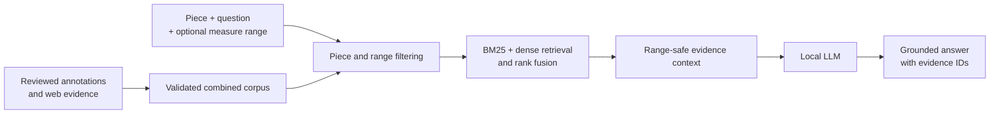

# RAG+LLM pipeline

The pipeline answers a musical-performance question from reviewed expert
annotations and supporting web evidence.

Its central rule is:

> The question determines **what** to retrieve, while the optional measure
> range determines **where** the evidence must apply.



## 1. Build the corpus

The system first builds one local corpus from two sources:

- **Expert annotations:** reviewed knowledge units from
  `soprano-qa-dataset/expert_curation/review/`
- **Web evidence:** validated, answer-eligible records from the scraped
  database

An expert record contains:

- its curated answer;
- permanent knowledge-unit and source IDs;
- original expert questions used as retrieval aliases;
- confirmed measure ranges;
- rewrite and measure-review states; and
- the original source answer when it is safe to expose during generation.

Human `source_ids` and web `web_source_ids` remain separate so the origin of
each claim is clear.

Only confirmed measure ranges are used for routing. Older range hints remain
available for provenance and disambiguation, but they are not treated as
confirmed locations.

The resulting searchable artifact is `data/corpus.json`.

## 2. Receive a query

Every query contains:

```text
piece_id + question + optional measure_range
```

For example:

```json
{
  "piece_id": "die-forelle",
  "question": "피아노 파트에서 두 번째 박의 악센트는 무엇을 표현할까?",
  "measure_range": [2, 27]
}
```

The measure range is structured metadata. It does not need to appear in the
question text.

If the question itself mentions a measure, that location must agree with the
structured range. The question cannot silently create or override retrieval
scope. Conversely, a structured range may be supplied even when the question
does not repeat its measure numbers.

If no range is supplied, it means **no range was selected**. It does not
automatically mean that every retrieved annotation applies to the whole
piece.

## 3. Retrieve relevant evidence

Retrieval proceeds in this order:

1. Keep only records for the selected piece.
2. Apply the selected measure range.
3. Run the existing Korean concept and BM25 search, including strict
   expert-question alias matching.
4. Independently embed the natural-language question and retrieve semantically
   similar knowledge units, allowing paraphrases outside the lexical concept
   gate to enter the candidate set.
5. Treat a terminal Korean answer relation such as `의미하다`, `표현하다`,
   or `상징하다` as a soft intent concept when the remaining content concepts
   are fully covered on the lexical path.
6. Fuse lexical and dense ranks with weighted reciprocal-rank fusion. Exact
   source-question aliases retain precedence within the same scope.
7. Select a small set of records that collectively covers the question.

Dense retrieval uses the local `Qwen3-Embedding-0.6B-Q8_0.gguf` checkpoint.
Knowledge-unit relevance and answer vectors are normalized and cached using a
fingerprint of the corpus text, model file, and embedding runtime settings. A
question receives an English retrieval instruction and is embedded once per
new normalized question in a process; a bounded hash-keyed cache reuses the
query vector across generation retries. Direct dot products over the 446
cached vector slots replace the need for a vector database. Dense model
loading and inference use the existing `llama-cpp-python` runtime.

Dense similarity never overrides corpus authority. Retrieval eligibility,
piece identity, topic, confirmed measure status, and range relationship are
checked independently for both candidate paths. A dense-only result for a
selected range must overlap that range; confident lexical evidence may still
report a confirmed non-overlapping annotation as secondary context. Low
similarity floors remove remote neighbours, while two precision guards handle
cases cosine similarity cannot separate: the query must have a music-domain
anchor, and an answer must support explicitly requested attributes such as
fingering, harmony analysis, BPM, page location, physical units, or a
left-versus-right assignment. These checks apply only to dense-only admission,
not to records already justified by the lexical path. Hybrid mode requires its
embedding checkpoint and backend. A missing checkpoint fails before corpus or
answer work begins, and runtime embedding failures propagate as hard errors;
model-free retrieval is available only through explicit lexical mode.

The soft relation path is deliberately separate from expert-question alias
matching: aliases remain strict because a positive alias match is authoritative
for evidence selection. A range-overlapping soft match may replace a merely
global surface-form hit, but the soft path returns only its best explanatory
record. Noun uses such as `가사의 의미`, performance requests such as
`어떻게 표현해야 하나요?`, and unmatched content concepts remain strict.

### When a measure range is selected

Ranges are inclusive. The retriever checks every requested interval against
every confirmed interval on each record.

| Evidence scope | Retrieval relation | Result |
| --- | --- | --- |
| A confirmed range intersects the selected range | `overlaps_query_range` | Kept and strongly preferred |
| No local range; explicitly whole-piece or global | `global_context` | Kept only when semantically relevant |
| Confirmed local ranges do not intersect | `other_range_context` | Kept as lower-ranked context only |
| Location is `waiting_for_review` or `unspecified` | Unconfirmed | Not used in a range-selected query |

For example, evidence with confirmed ranges `[[2, 27], [41, 54]]` overlaps a
query for `[2, 27]`, but it does not overlap `[28, 40]`.

The range contribution to ranking is:

| Relation | Score adjustment |
| --- | ---: |
| Overlapping recurring expert evidence | `+6.0` |
| Other overlapping evidence | `+5.0` |
| Global context | `+0.25` |
| Confirmed non-overlapping local evidence | `-1.0` |

Scope priority is applied before lexical or fused relevance. Therefore, an
overlapping record ranks ahead of global context even if the global record has
more lexical overlap. If any semantically relevant overlapping candidate
exists, the final selected set must contain overlapping evidence.

Semantically relevant confirmed non-overlapping records are retained after
overlapping and global records. They receive
`evidence_role: other_range_context_only`. This preserves useful annotations
for inspection and lets the pipeline detect a possible range mismatch, but
their claims cannot be transferred to the selected passage or cited as its
grounding.

If no relevant overlapping record exists, semantically relevant global and
other-range context may still be returned. Global evidence can explain
general background. Other-range evidence is shown separately, while the
answer states that no evidence directly supports the selected range.

A web record can support an exact measure claim only when it identifies both
the applicable edition and its measure-numbering system. Otherwise it is
treated only as global context.

Only the best one or two semantically matching other-range records are kept.
In a mixed LLM prompt, only their IDs and range metadata are exposed as a
range-mismatch signal; their musical claims are withheld from generation.
The complete records are still returned in the service evidence list for
inspection. A secondary-only result is not sent to the LLM as a grounded
answer. If a generated draft nevertheless cites secondary evidence, the
draft is discarded, a primary-only extractive answer is returned, and the
result is classified as extractive rather than RAG+LLM.

### When no measure range is selected

- No range-overlap filter is applied.
- Whole-piece and global evidence establishes claims about the piece in
  general.
- For a broad question about how to sing the piece, retrieval deliberately
  mixes whole-piece guidance with a small, varied set of confirmed local
  annotations about technique, diction, rhythm, and interpretation.
- If one selected expert source was curated into several complementary
  knowledge units, the broad result keeps its same-scope siblings together.
  This preserves combinations such as tone-colour and diction advice without
  joining unrelated annotations merely because the question is broad.
- The question may also name one of those facets, such as breathing,
  pronunciation, or musical expression. In that case, the broad search keeps
  only guidance that actually mentions the requested facet.
- A confirmed local annotation is labeled `local_example`. Its exact
  `measure_range` may be named in the answer, but its advice remains attached
  to those measures. It does not prove that the same feature occurs
  throughout the piece, often, or in many places.
- Pending annotations have no citable location and are not generalized to the
  entire piece. They are used only when confirmed guidance is unavailable,
  with their review limitation exposed.

For example, if a local annotation says that a high note is not on the strong
beat and has confirmed ranges `[[63, 63], [82, 83]]`, a broad answer may say:

```text
예를 들어 63마디와 82–83마디에서는 고음이 강박에 놓이지 않으므로 …
```

It may not turn those two examples into “이 곡에는 이런 부분이 많이
나온다” unless separate whole-piece evidence explicitly supports that
frequency claim. Only confirmed knowledge-unit ranges supply the printed
numbers; old source-text locators and legacy hints are neutralized. If a
review note contains disputed locations, the answer labels them only as
unconfirmed locations rather than printing competing measure numbers.

The question is normalized before lexical matching: piece names, measure
expressions, and generic question wording are removed from the lexical query.
Korean concept normalization and BM25 are then used together. Dense query
preparation removes piece and measure routing syntax but keeps the natural
question wording. Structured output reports `concept_coverage`,
`content_concept_coverage`, `answer_relation_score`, `dense_score`,
`dense_content_score`, `fusion_score`, `retrieval_mode`, and
`semantic_match_type`, making lexical,
dense, strict, and soft matches distinguishable. Alias-enriched concepts can
help find candidates, but a lexical soft match also requires explanatory
language and content anchors in the knowledge-unit answer itself.

Range overlap alone is never enough. A record must also be semantically
relevant to the question.

When an original expert-question alias strongly matches the user question,
the strongest range-applicable expert records remain primary. Up to two
confirmed non-overlapping alias matches may follow as explicitly secondary
context; a stronger other-range alias can never displace overlapping
evidence.

## 4. Construct a range-safe prompt

The prompt contains only the selected evidence, including:

- evidence IDs and provenance;
- confirmed measure ranges and their relation to the query;
- whether each record is selected-range support, general context, or
  other-range context only;
- curated expert answers;
- applicable original expert context;
- rewrite and measure-review notes; and
- web edition and rights information when relevant.

Two safeguards prevent claims from leaking between ranges:

- If one knowledge unit combines source comments for different ranges, only
  the source material applicable to the selected range is exposed.
- If one source answer was split into several knowledge units, its full text
  is not copied into every unit. Each unit contributes only its assigned
  claim.

The LLM is instructed to:

- answer only from retrieved evidence;
- preserve the expert's uncertainty, alternatives, and practical nuance;
- avoid inventing measures, notation, lyrics, pronunciation, or vocal advice;
- use a `local_example` only with its confirmed measure numbers and keep its
  claim local rather than generalizing it to the whole piece;
- never cite, paraphrase, or apply an `other_range_context_only` claim to the
  selected range; and
- cite the supplied evidence labels.

After generation, the pipeline checks these rules claim by claim. Every claim
that cites a local example must name one of that item's canonical ranges in
the same claim. A different whole-piece record does not silently broaden the
local claim. Any printed measure locator must come from the selected query
range or from a local example cited in that claim; source-only and legacy
locators are rejected. An unsafe draft gets one focused repair pass. If it is
still unsafe, the service returns a range-labeled expert extract instead.

If an annotation still requires human review, its review note becomes a hard
prompt constraint and the answer begins with a visible `검토 주의:` notice.

## 5. Generate and finalize the answer

The selected context is sent to the local Qwen3-8B model.

After generation, the application:

- checks for obvious decoding corruption and requests a grounded rewrite if
  needed;
- retries with fewer complete evidence records if the prompt exceeds the
  model's context limit;
- maps temporary labels such as `[E1]` to permanent corpus IDs;
- removes unknown citations;
- adds an evidence footer when needed; and
- attaches deterministic source and rights notices for web evidence.

If retrieved evidence exists but the LLM cannot produce a usable answer, the
system returns a cited extractive answer instead of discarding the grounding.
Optional internal model knowledge is considered only when retrieval finds no
evidence, and that answer is explicitly marked as ungrounded.

## 6. Returned result

The service returns:

- the generated answer;
- whether it came from the LLM, extractive evidence, or internal knowledge;
- whether its basis was retrieved evidence;
- whether primary and selected-range grounding exist, plus the role of every
  evidence record and whether confirmed local examples are present;
- the selected measure range; and
- the exact evidence records and retrieval scores.

The most important distinction is:

```text
retrieved evidence → grounded answer
no retrieved evidence → optional, explicitly ungrounded fallback
```

## Implementation map

| Pipeline stage | Main file |
| --- | --- |
| Corpus construction | `soprano_qa/corpus.py` |
| Measure handling and retrieval | `soprano_qa/retrieval.py` |
| Prompt construction and answer finalization | `soprano_qa/answer.py` |
| End-to-end orchestration | `soprano_qa/service.py` |
